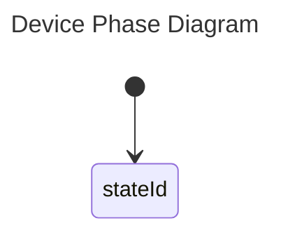

# krsm
A state machine library for Kubernetes Resources

## Example

Consider a `Device` with following States and SubStates:

```mermaid
---
title: Device Phase Diagram
---
stateDiagram-v2
    stateId

  [*] --> stateId
```

